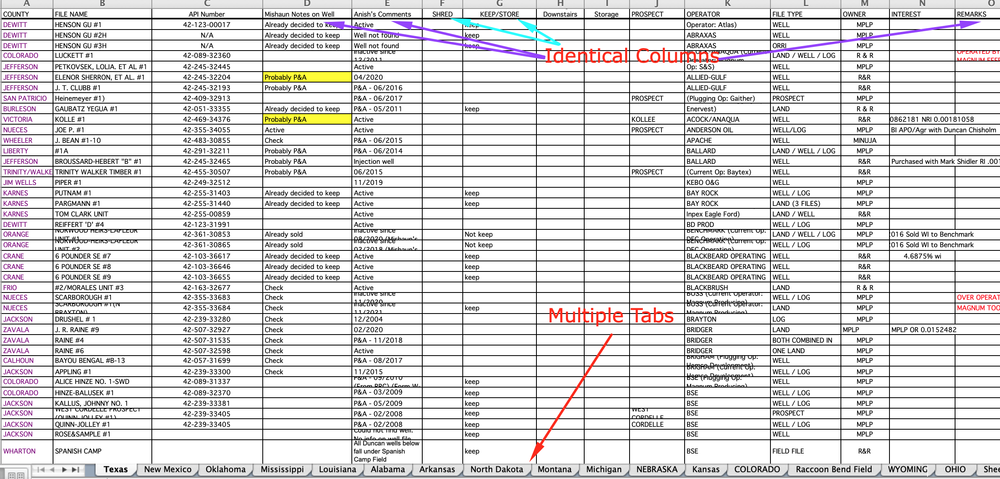
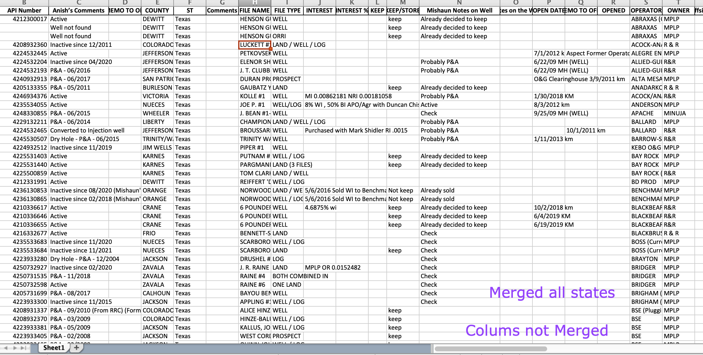
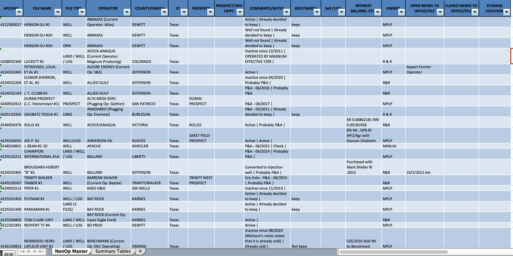
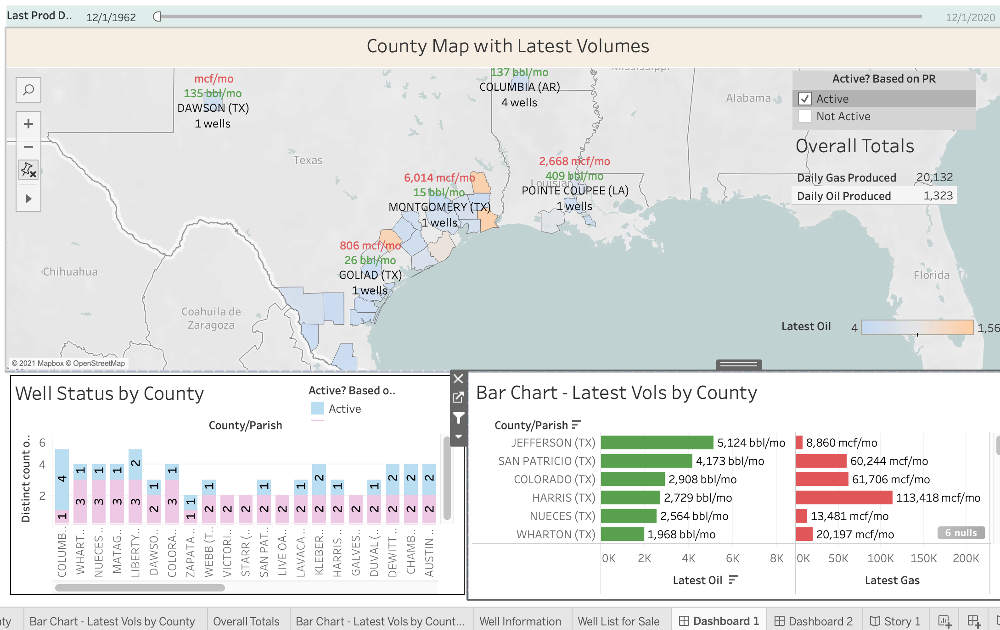

# Project Goals

1.  Clean and Transform Internal Company Data Pertaining to Non-Operated Properties

2.  Clean and Prepare Data for Company Operated Properties for Creating Geographic Visualizations in Tableau 


# Libraries
Pandas, Request, Regular Expression


# 1.  Non Operated Data Transformation

## Tasks:

1. Import company Excel Workbook having multiple tabs/sheets, each holding non operated wells by state
2. Merge all sheets into a unified table
3. Identify duplicate & similar columns
4. Write functions to merge similar fields
5. Clean up text and reorder merged fields
6. Upload to Google Sheets for Data Entry Team

---

### *Notes & Observations on Data Source*
* All sheets have similar data fields that may vary by name or hold identicical field information

* The unification will result in a large, messy table, where multiple columns holding identical information will need to be merged

    * For example: A data sheet may have 4 different columns holding comments from 4 separate people, we would like to merge this into one column, "Comments"

## Images of Data and Transformations

1.  Raw/Source Data 



2.  Unified Table by State With Duplicate Fields


3.  Final Table - Merged Fields, Cleaned Text, and Reordered



## Code Snippets
* Dictionary for Identical Columns to be Merged
```python
#dictionary to hold info on merging columns and their output column name
ColsMergeDict = {
    "INTEREST (WI,ORRI, ETC)": ["INTEREST", "INTEREST %"], 
    "KEEP/SHRED": ["KEEP","KEEP/STORE", "SHRED"], 
    "COUNTY/PARISH": ["COUNTY", "PARISH"], 
    "Sagar": ["Sagar First Duplicate", "Sagar Second Duplicate"], #merging sagar's comments first then merging at end, it will work due to the choronology of the loop
    "STORAGE LOCATION": ["Storage Downstairs", "Offsite Storage"], 
    "DATE OPENED": ["OPENED", "OPEN DATE"],
    "COMMENTS/NOTES": ["Anish’s Comments", "Mishaun Notes on Well", "Notes on the Well", "Comments", "REMARKS", "Sagar"] 
}
```

* Function to Merge Passed Columns
```python
def MergeColsbyName(dataframe, *columnstomerge, mergedColName):
    
    '''
    Columns to merge must be passed in as a list
    
    This function will take in a pandas dataframe, columns to merge, and an ouput column name after the merge
    It will then merge the columns together by concatenating values as text
    If there are multiple columns with nonnull values, the values will be concatenated with a pipe | symbol
    If there is just 1 column with non null values, columns will be concatenated with a blank space
    The columns that were merged will then be dropped from the dataframe and the dataframe will be returned
    
    '''

    columnstomerge = columnstomerge[0]
    
    #reference to how to use apply on multiple columns https://stackoverflow.com/questions/39291499/how-to-concatenate-multiple-column-values-into-a-single-column-in-panda-datafram
    # This lambda function will join columns that are selected together 
    # conditional statements direct that if there is only 1 non null field, merge with blank string ->
    # else, if there are more than 1 non null field, merge values together with a pipe | symbol
    dataframe[mergedColName] = dataframe[columnstomerge].apply(lambda row: ''.join(row.fillna('').values.astype(str)) if row.count()<2 else ' | '.join(row.fillna('').values.astype(str)), axis=1)
    
    #dropping columns after merging
    dataframe.drop(columns = columnstomerge, inplace = True)
    
    return dataframe
```

---

# 2. Operated Company Data Preperation

## Tasks:

1. Download Source Files:
    1. Operated Production Data Set from Enverus/DrillingInfo
        * This source pulls from government commission records
    2. Operated Permits Data Set from Enverus/DrillingInfo
    3. US Counties Shapefile - ESRI
    4. US Postal Codes - USDA

2. Clean up fields to join tables
3. Add calculated/custom fields based on President's requests
4. Create Tableau Dashboard to View Company Production by Geography

## Images of Dashboard

1. Production Tableau Dashboard (Afer Data Cleaning)

